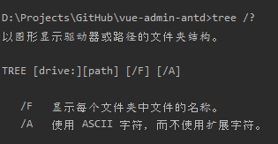

# vue-admin-antd
> 技术栈：Vue 全家桶，Typescript，Ant Design UI组件库

- <a href='#prototype'>Vue 实例方法</a>
- <a href='#standard'>代码规范</a>
- <a href='#directory'>文件结构</a>
- <a href='#npm'>项目命令</a>

## <h2 id='prototype'>Vue 实例方法</h2>

> 以下是项目中给 Vue 添加的实例方法，不含 Vue 自带的方法

1. $message, $notification, $info, $success, $error, $warning, $confirm, $form：ant design 的方法，在 [src/plugins/antd.ts](src/plugins/antd.ts) 中添加。

1. $rules：表单验证规则，在 [src/main.ts](src/main.ts) 中添加。

## <h2 id='standard'>代码规范</h2>

- [API 接口规范](./src/api/README.md)
- [Mock 数据规范](./src/api/mock/README.md)
- [Vuex Store 全局变量规范](./src/store/README.md)
- [Component 组件规范](./src/components/README.md)
- [Util 工具规范](./src/utils/README.md)
- [View 页面规范](./src/views/README.md)

### 引入新模块，必须在使用的地方注释
``` javascript
/**
 * xxx
 *
 * @dependency xxx (npm | yarn 引入的依赖包名)
 * @dependency xxx
 */
```

### 代码有待改进，因各种原因未改需注释
``` javascript
// TODO
/**
 * xxx
 *
 * @todo xxx
 */
```

## <h2 id='directory'>文件结构</h2>

> Windows下，使用tree直接生成文件结构
>
> 虽然和Linux系统下相差很多，基本的还是可以使用的
> 
> 查看命令帮助
> ```
> D:\Projects\GitHub\vue-admin-antd>tree /?
> 以图形显示驱动器或路径的文件夹结构。
> 
> TREE [drive:][path] [/F] [/A]
> 
>    /F   显示每个文件夹中文件的名称。
>    /A   使用 ASCII 字符，而不使用扩展字符。
> ```
[^_^]: #图片在github上老是加载失败，特换成以上代码
[^_^]: #

```
├─.browserslistrc            #browserslist配置
├─.env.development           #开发环境变量配置
├─.env.production            #生产环境变量配置
├─.eslintignore              #eslint ignore文件配置
├─.eslintrc.js               #eslint规范
├─.gitignore                 #git ignore文件配置
├─babel.config.js            #babel配置
├─package.json               #包管理文件
├─package-lock.json          #包管理文件
├─README.md                  #项目介绍
├─tsconfig.json              #typescript配置
├─vue.config.js              #vue配置
│
├─dist                       #项目打包文件夹
│
├─docs                       #项目文档打包文件夹
│
├─public                     #静态资源主目录，打包时，该目录下资源会不做特殊处理，copy到输出目录
│  ├─favion.ico              #网站小图标
│  └─index.html              #入口html文件
│
└─src                        #项目资源主目录
   ├─App.vue
   ├─main.ts                 #vue实例化
   ├─shims-tsx.d.ts          #tsx的声明
   ├─shims-vue.d.ts          #vue的声明
   │
   ├─api                     #除mock文件夹，其他文件名都采用PascalCase的命名方式
   │  ├─README.md            #api文件规范
   │  ├─AxiosInterceptor.ts  #axios请求拦截函数，所有请求必须使用该函数
   │  ├─Xxx.ts               #模块xxx的api
   │  │
   │  └─mock                 #文件名都采用kebab-case的命名方式
   │     ├─index.js          #mock数据合集
   │     ├─mock-server.js    #启动mock server配置
   │     ├─response.js       #mock数据基本返回格式
   │     └─xxx.js            #模块xxx的mock数据
   │
   ├─assets                  #静态文件，文件名都采用kebab-case的命名方式
   │  ├─images               #图片文件
   │  │  ├─logo.png          #logo图片
   │  │  │
   │  │  └─markdown          #markdown中使用的图片
   │  │     └─tree.png       #tree帮助图片
   │  │
   │  └─less
   │     ├─ant-theme.less     #重置ant design样式
   │     ├─ant-vars.less      #ant design全局变量默认值
   │     └─global.less        #全局自定义样式
   │
   ├─components               #组件，文件名都采用PascalCase的命名方式
   │  ├─README.md             #component文件规范
   │  └─Xxx.vue               #单组件文件
   │
   ├─plugins                  #插件，文件名都采用kebab-case的命名方式
   │  ├─antd.ts               #按需引入ant design的组件和组件样式
   │  └─antd-icon.ts          #按需引入ant design的icon图标
   │
   ├─router                   #路由
   │  └─index.ts
   │
   ├─store                    #状态管理
   │  ├─README.md             #store文件规范
   │  └─index.ts
   │
   ├─utils                    #工具文件，文件名都采用PascalCase的命名方式
   │  ├─README.md             #工具文件规范
   │  └─Xxx.ts
   │
   └─views                    #视图，文件名都采用kebab-case的命名方式
      ├─README.md             #view文件规范
      └─xxx.vue               #页面文件
```

## <h2 id="npm">项目命令</h2>

```
npm install
```

### Compiles and hot-reloads for development
```
npm run serve
```

### Compiles and minifies for production
```
npm run build
```

### Compiles and minifies for doc
```
npm run build:doc
```

### Lints and fixes files
```
npm run lint
```

### Customize configuration
See [Configuration Reference](https://cli.vuejs.org/config/).
